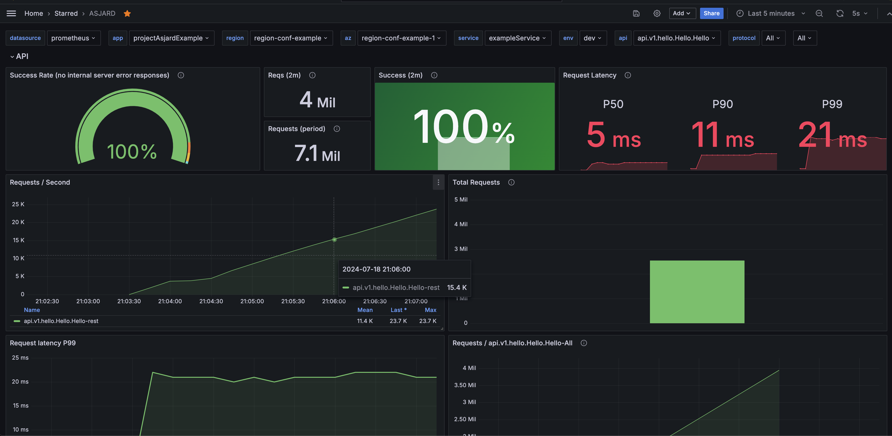

> 监控

### 配置

```yaml
asjard:
  metrics:
    ## 是否开启指标收集
    ## 如果开启了rest服务，则rest服务会多一个/metrics路由
    enabled: true
    ## 需要收集的指标
    ## *代表所有指标
    collectors:
      - go_collector
      - process_collector
      - db_default_collector
      - api_requests_total
      - api_requests_latency_ms
    ## pushgateway配置
    ## 建议使用pushgateway方式收集指标
    pushGateway:
      ## 地址,不要路由
      endpoint: http://127.0.0.1:9091
      ## push间隔
      interval: 5s
```

### 自定义指标

```go
import "github.com/asjard/asjard/core/metrics"

func main() {
	// 注册一个计数器指标
	// 如果注册成功，counter返回非nil值，如果注册失败则返回nil值
	// 可反复注册
	// 如果配置了pushgateway则不能携带app,env,service,service_version,instance这些label
	counter := metrics.RegisterCounter("name_of_counter_metrics", "This is a counter help", []string{"label_1", "label_2"})
	if counter !=nil{
		counter.With(map[string][string]{"label_1": "label_1_value", "label_2": "label_2_value"}).Inc()
	}

}
```

## 看板

参考[grafana](../media/grafana_asjard.json),效果如下(持续完善中):


