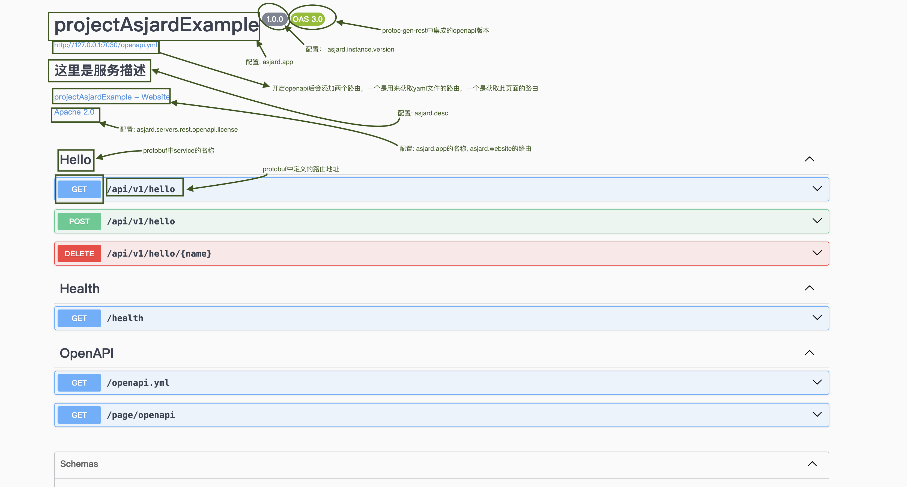

> 可以通过暴露rest服务队外提供HTTP服务

### 配置

```yaml
asjard:
  ## 多协议服务相关配置
  ## 不实时生效，修改后需重新启动
  servers:
    ## 协议无关的服务端拦截器列表,多个拦截器以英文逗号(,)分隔
    ## 默认为为accessLog
    interceptors: "accessLog"
    ## rest(HTTP)协议相关配置
    rest:
      ## 服务端拦截器名称，多个拦截器以英文都好分隔
      ## 或者配置成列表
      interceptors: "accessLog,restReadEntity,restResponseHeader"
      ## 例如列表方式
      # interceptors:
      #   - accessLog
      #   - restReadEntity
      #   - restResponseHeader
      ## 是否对外暴露rest服务
      enabled: true
      ## 服务端证书文件名称, 相对于ASJARD_CONF_DIR/certs所在目录的路径
      certFile: ""
      ## 服务端私钥文件名称,相对于ASJARD_CONF_DIR/certs所在目录的路径
      keyFile: ""
      ## 文档相关配置
      doc:
        ## 错误页地址, 如果错误返回，默认可以解决错误的文档地址
        ## 如果不配置则使用website配置
        errPage: ""
      ## 是否开启openapi
      openapi:
        enabled: false
        ## 一个可以展示openapi.yml文件的页面
        page: https://petstore.swagger.io/?url=http://%s/openapi.yml
        termsOfService: ""
        license:
          name: Apache 2.0
          url: http://www.apache.org/licenses/LICENSE-2.0.html
      ## 跨域相关配置
      ## 跨域是自动开启的
      cors:
        allowOrigins:
          - "*"
        allowMethods:
          - GET
          - POST
          - PUT
          - DELETE
          - PATCH
        allowHeaders:
          - Origin
          - Content-Type
          - Content-Length
        allowCredentials: false
      ## 同grpc相关配置
      addresses:
        listen: 127.0.0.1:7030
        # advertise: 127.0.0.1:7030
      ## 服务启动相关配置
      # options:
      #   ## The maximum number of concurrent connections the server may serve.
      #   ##
      #   ## DefaultConcurrency is used if not set.
      #   ##
      #   ## Concurrency only works if you either call Serve once, or only ServeConn multiple times.
      #   ## It works with ListenAndServe as well.
      #   Concurrency: !!int 262144

      #   ## Per-connection buffer size for requests' reading.
      #   ## This also limits the maximum header size.
      #   ##
      #   ## Increase this buffer if your clients send multi-KB RequestURIs
      #   ## and/or multi-KB headers (for example, BIG cookies).
      #   ##
      #   ## Default buffer size is used if not set.
      #   ReadBufferSize: !!int 4096

      #   ## Per-connection buffer size for responses' writing.
      #   ##
      #   ## Default buffer size is used if not set.
      #   WriteBufferSize: !!int 4096

      #   ## ReadTimeout is the amount of time allowed to read
      #   ## the full request including body. The connection's read
      #   ## deadline is reset when the connection opens, or for
      #   ## keep-alive connections after the first byte has been read.
      #   ##
      #   ## By default request read timeout is unlimited.
      #   ReadTimeout: !!str 3s

      #   ## WriteTimeout is the maximum duration before timing out
      #   ## writes of the response. It is reset after the request handler
      #   ## has returned.
      #   ##
      #   WriteTimeout: !!str 1h

      #   ## IdleTimeout is the maximum amount of time to wait for the
      #   ## next request when keep-alive is enabled. If IdleTimeout
      #   ## is zero, the value of ReadTimeout is used.
      #   IdleTimeout: !!str 0s

      #   ## Maximum number of concurrent client connections allowed per IP.
      #   ##
      #   ## By default unlimited number of concurrent connections
      #   ## may be established to the server from a single IP address.
      #   MaxConnsPerIP: !!int 0

      #   ## Maximum number of requests served per connection.
      #   ##
      #   ## The server closes connection after the last request.
      #   ## 'Connection: close' header is added to the last response.
      #   ##
      #   ## By default unlimited number of requests may be served per connection.
      #   MaxRequestsPerConn: !!int 0

      #   ## MaxIdleWorkerDuration is the maximum idle time of a single worker in the underlying
      #   ## worker pool of the Server. Idle workers beyond this time will be cleared.
      #   MaxIdleWorkerDuration: !!str 10m

      #   ## Period between tcp keep-alive messages.
      #   ##
      #   ## TCP keep-alive period is determined by operation system by default.
      #   TCPKeepalivePeriod: !!str 0s

      #   ## Maximum request body size.
      #   ##
      #   ## The server rejects requests with bodies exceeding this limit.
      #   ##
      #   ## Request body size is limited by DefaultMaxRequestBodySize by default.
      #   ## 4 * 1024 * 1024
      #   MaxRequestBodySize: !!int 4194304

      #   ## Whether to disable keep-alive connections.
      #   ##
      #   ## The server will close all the incoming connections after sending
      #   ## the first response to client if this option is set to true.
      #   ##
      #   ## By default keep-alive connections are enabled.
      #   DisableKeepalive: !!bool false

      #   ## Whether to enable tcp keep-alive connections.
      #   ##
      #   ## Whether the operating system should send tcp keep-alive messages on the tcp connection.
      #   ##
      #   ## By default tcp keep-alive connections are disabled.
      #   TCPKeepalive: !!bool false

      #   ## Aggressively reduces memory usage at the cost of higher CPU usage
      #   ## if set to true.
      #   ##
      #   ## Try enabling this option only if the server consumes too much memory
      #   ## serving mostly idle keep-alive connections. This may reduce memory
      #   ## usage by more than 50%.
      #   ##
      #   ## Aggressive memory usage reduction is disabled by default.
      #   ReduceMemoryUsage: !!bool false

      #   ## Rejects all non-GET requests if set to true.
      #   ##
      #   ## This option is useful as anti-DoS protection for servers
      #   ## accepting only GET requests and HEAD requests. The request size is limited
      #   ## by ReadBufferSize if GetOnly is set.
      #   ##
      #   ## Server accepts all the requests by default.
      #   GetOnly: !!bool false

      #   ## Will not pre parse Multipart Form data if set to true.
      #   ##
      #   ## This option is useful for servers that desire to treat
      #   ## multipart form data as a binary blob, or choose when to parse the data.
      #   ##
      #   ## Server pre parses multipart form data by default.
      #   DisablePreParseMultipartForm: !!bool true

      #   ## Logs all errors, including the most frequent
      #   ## 'connection reset by peer', 'broken pipe' and 'connection timeout'
      #   ## errors. Such errors are common in production serving real-world
      #   ## clients.
      #   ##
      #   ## By default the most frequent errors such as
      #   ## 'connection reset by peer', 'broken pipe' and 'connection timeout'
      #   ## are suppressed in order to limit output log traffic.
      #   LogAllErrors: !!bool false

      #   ## Will not log potentially sensitive content in error logs
      #   ##
      #   ## This option is useful for servers that handle sensitive data
      #   ## in the request/response.
      #   ##
      #   ## Server logs all full errors by default.
      #   SecureErrorLogMessage: !!bool false

      #   ## Header names are passed as-is without normalization
      #   ## if this option is set.
      #   ##
      #   ## Disabled header names' normalization may be useful only for proxying
      #   ## incoming requests to other servers expecting case-sensitive
      #   ## header names. See https:##github.com/valyala/fasthttp/issues/57
      #   ## for details.
      #   ##
      #   ## By default request and response header names are normalized, i.e.
      #   ## The first letter and the first letters following dashes
      #   ## are uppercased, while all the other letters are lowercased.
      #   ## Examples:
      #   ##
      #   ##     * HOST -> Host
      #   ##     * content-type -> Content-Type
      #   ##     * cONTENT-lenGTH -> Content-Length
      #   DisableHeaderNamesNormalizing: !!bool false

      #   ## SleepWhenConcurrencyLimitsExceeded is a duration to be slept of if
      #   ## the concurrency limit in exceeded (default [when is 0]: don't sleep
      #   ## and accept new connections immediately).
      #   SleepWhenConcurrencyLimitsExceeded: !!str 0s

      #   ## NoDefaultServerHeader, when set to true, causes the default Server header
      #   ## to be excluded from the Response.
      #   ##
      #   ## The default Server header value is the value of the Name field or an
      #   ## internal default value in its absence. With this option set to true,
      #   ## the only time a Server header will be sent is if a non-zero length
      #   ## value is explicitly provided during a request.
      #   NoDefaultServerHeader: !!bool false

      #   ## NoDefaultDate, when set to true, causes the default Date
      #   ## header to be excluded from the Response.
      #   ##
      #   ## The default Date header value is the current date value. When
      #   ## set to true, the Date will not be present.
      #   NoDefaultDate: !!bool false

      #   ## NoDefaultContentType, when set to true, causes the default Content-Type
      #   ## header to be excluded from the Response.
      #   ##
      #   ## The default Content-Type header value is the internal default value. When
      #   ## set to true, the Content-Type will not be present.
      #   NoDefaultContentType: !!bool false

      #   ## KeepHijackedConns is an opt-in disable of connection
      #   ## close by fasthttp after connections' HijackHandler returns.
      #   ## This allows to save goroutines, e.g. when fasthttp used to upgrade
      #   ## http connections to WS and connection goes to another handler,
      #   ## which will close it when needed.
      #   KeepHijackedConns: !!bool false

      #   ## CloseOnShutdown when true adds a `Connection: close` header when the server is shutting down.
      #   CloseOnShutdown: !!bool true

      #   ## StreamRequestBody enables request body streaming,
      #   ## and calls the handler sooner when given body is
      #   ## larger than the current limit.
      #   StreamRequestBody: !!bool false
```

### 开启openapi文档

```yaml
asjard:
  servers:
    rest:
      openapi:
        enabled: true
        ## 一个可以展示openapi.yml文件的页面
        page: https://petstore.swagger.io/?url=http://%s/openapi.yml
        termsOfService: ""
        license:
          name: Apache 2.0
          url: http://www.apache.org/licenses/LICENSE-2.0.html
```

- 访问`localhost:7030/page/openapi`即将会跳转到`asjard.servers.rest.openapi.page`页面

- 其中显示信息如下图所示:



### 跨域配置

### 示例
